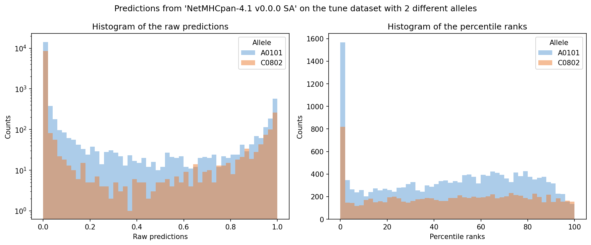

# Calibration

## Issue with allele-independent scoring

The raw predictions (probabilities) of a binding model may be distributed differently across MHC
molecules (alleles). Given an allele, the raw scores produce a different distribution compared to
another allele, as illustrated below with two alleles (`A0101` and `C0802`) on the tune dataset
using the NetMHCpan-4.1 v0.0.0 SA model.

In a context where the distribution of predicted binding probability can significantly differ
between alleles, a score of 0.8 might represent a median score for one allele and the very best
peptide for another allele. This is a problem when performing any operation across several alleles:
the computation of a global metric, the deconvolution of multi-allelic data, etc.

## Per-allele normalization: the percentile rank

To deconvolute multi-allelic (MA) data or to use the binding model's outputs for downstream tasks,
the predictions need to be normalized across alleles. **Calibration is hence a transformation that
normalizes prediction scores across different alleles**.

The percentile rank of a given peptide sequence is computed by comparing its raw prediction score to
a distribution of prediction scores for the allele in question, estimated from a set of random
natural peptides gathered in a **reference set**. These reference prediction scores are the
predictions of the given model checkpoint on the reference set using the allele in question as
input. For a given allele, a percentile rank of 1% for a peptide means the latter is scored above
99% of the peptides from the reference set.


/// caption
Left: distribution of raw prediction scores for two alleles (log scale). The distributions differ
significantly between alleles. Right: distribution of percentile ranks after calibration, which
are now comparable across alleles.
///

## Peptide reference set

The reference set used for calibration is a collection of random natural peptides. In BenchMHC,
the default reference set is stored in the
[bucket](bucket.md) at `random_reference_set/10k_9mers.csv` and contains 10,000 random 9-mer
peptides. Since it contains 9-mers, this reference set is designed for **MHC class I** calibration.
For MHC class II, a reference set with longer peptides (e.g., 15-mers) would be needed.

The reference file can contain either peptide sequences only, or pre-built peptide-allele
combinations:

- **`--peptides_only` flag** (recommended): when this flag is set, the reference file is expected
  to contain only peptide sequences (one per row). The calibration pipeline then builds the
  reference set as the **Cartesian product** of all unique peptides from the file and the
  representative alleles (one per unique pseudo sequence). This means the model runs predictions
  for every peptide-allele combination, which can represent ~50,000,000 samples when calibrating
  across all alleles.
- **Without `--peptides_only`**: the reference file must already contain pre-built peptide-allele
  pairs as rows. This is useful when you have a custom reference set with specific peptide-allele
  combinations.

## How it works in BenchMHC

The calibration pipeline in BenchMHC performs the following steps:

1. **Allele grouping**: loads the allele-to-pseudo-sequence mapping and groups alleles by unique
   pseudo sequences. For each group, the first allele is used as a representative for calibration.

2. **Reference set construction**: builds a reference set by taking the Cartesian product of all
   unique peptides in the provided reference set and the representative alleles.

3. **Prediction**: runs predictions for all peptide-allele pairs using the specified model(s).

4. **Percentile rank computation**: for each output type (`hit` and `binding_affinity`), and for
   each allele group, computes percentile ranks from the predictions using
   `PercentileRankCalculator`.

5. **Output**: saves the resulting percentile rank files as `.npz` files, named
   `{allele}__{output_name}.npz`, in the specified output directory.

## Usage

!!! example "Calibrate a model"

    ```bash
    # Pull the reference set
    gcloud storage cp -r \
        gs://bench-mhc/random_reference_set/10k_9mers.csv \
        random_reference_set/10k_9mers.csv

    # Run calibration
    calibrate \
        -m /path/to/model \
        -o /path/to/output_directory \
        -r random_reference_set/10k_9mers.csv \
        --peptides_only \
        --batch_size 8192
    ```

!!! tip "Calibrating for specific alleles"

    If you only need percentile ranks for a subset of alleles, use the `--alleles` flag to
    avoid running predictions for the full allele set. Allele names must use the unformatted
    notation (e.g., `HLA__A0201` instead of `HLA-A*02:01`):

    ```bash
    calibrate \
        -m /path/to/model \
        -o /path/to/output_directory \
        -r random_reference_set/10k_9mers.csv \
        --peptides_only \
        --alleles HLA__A0201,HLA__B0702
    ```

More details on the command with `calibrate --help` or in the
[API reference](../reference/api/calibrate.md).
