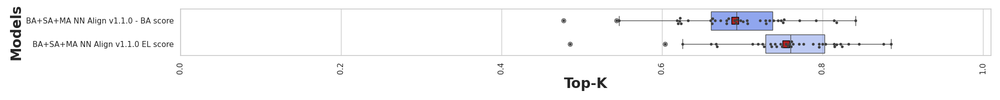

# Benchmark on MS ligands v2.0.0

## Evaluation dataset

The performance of our models was evaluated using a regenerated version of the MS ligands datasets
(v2.0.0). The details of the differences between these data and the original ones can be found in
the [MS ligands v2.0.0](../../datasets/ms_ligands.md#v200) section of the datasets documentation.

This evaluation datasets can be found at:

```bash
gs://bench-mhc/data/v2.0.0/evaluation/ms_ligands.csv
```

## Models

Models included in the benchmark:

- [NetMHCPan-4.1](../../models/netmhcpan41_v_1_1_0.md)

## Results

<!-- markdownlint-disable MD051 -->
<!-- to avoid issues with + in anchor links -->
|            Model             |       Head       | Per-allele Mean Top-K | Global Top-K | Per-allele Mean AP | Global AP |
|:----------------------------:|:----------------:|:---------------------:|:------------:|:------------------:|:---------:|
| NetMHCPan-4.1 (BA + SA + MA) | Binding Affinity |         0.692         |    0.632     |       0.713        |   0.636   |
| NetMHCPan-4.1 (BA + SA + MA) |       Hit        |         0.755         |    0.741     |       0.796        |   0.780   |
<!-- markdownlint-enable MD051 -->


/// caption
Per-allele Top-K on MS ligands for each model. The box plots show the distribution of per-allele
Top-Ks across the 36 alleles in the evaluation set.
///

??? note "MS ligands plots reproduction"

    All metric files required to plot the MS ligands performance plots are available under :arrow_down:
    ```bash
    gs://bench-mhc/metrics/v2.0.0/
    ```
    You can simply use the following configuration with the `generate-performance-plot` command line
    to regenerate the above plot.

    ```yaml
    "BA+SA+MA NN Align v1.1.0 - BA score":
      metrics_path: "bench-mhc/metrics/v2.0.0/ms_ligands_nn_align_mhc1_ba_sa_ma_v_1_1_0_ensemble__binding_affinity_hit.csv"

    "BA+SA+MA NN Align v1.1.0 EL score":
      metrics_path: "bench-mhc/metrics/v2.0.0/ms_ligands_nn_align_mhc1_ba_sa_ma_v_1_1_0_ensemble__hit_hit.csv"
      bright_version_of: "BA+SA+MA NN Align v1.1.0 - BA score"
    ```
