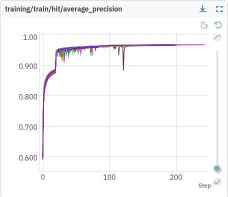
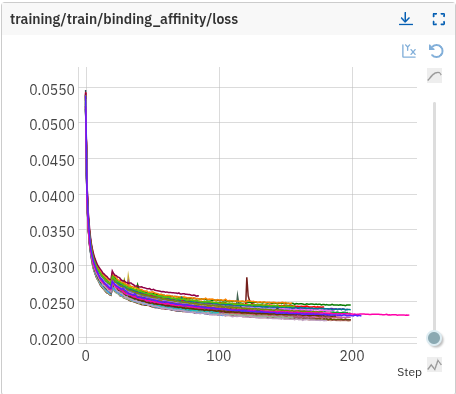
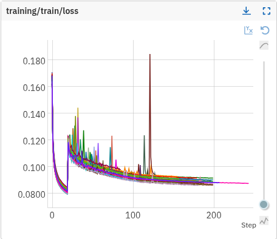
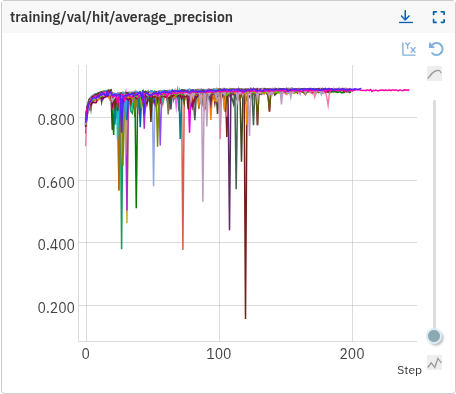
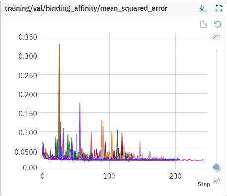
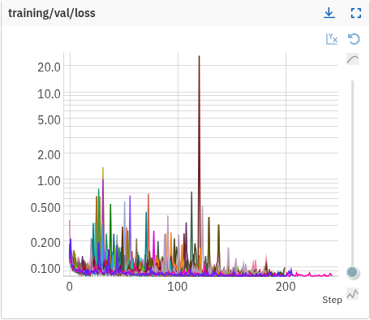
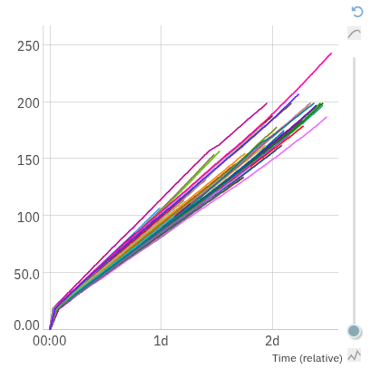
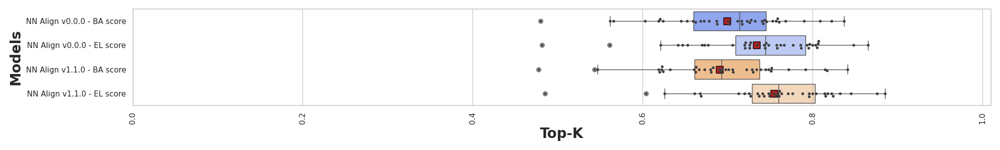
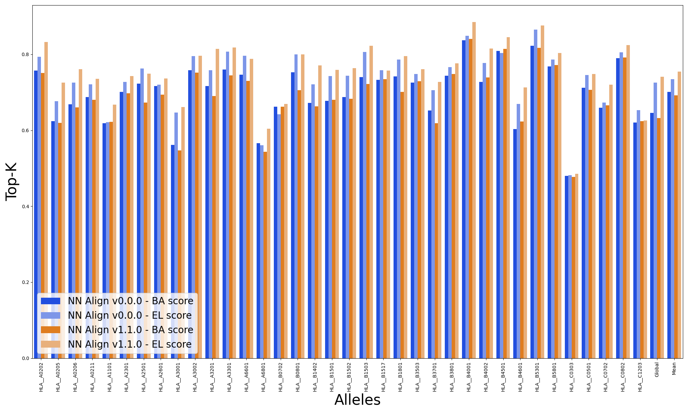
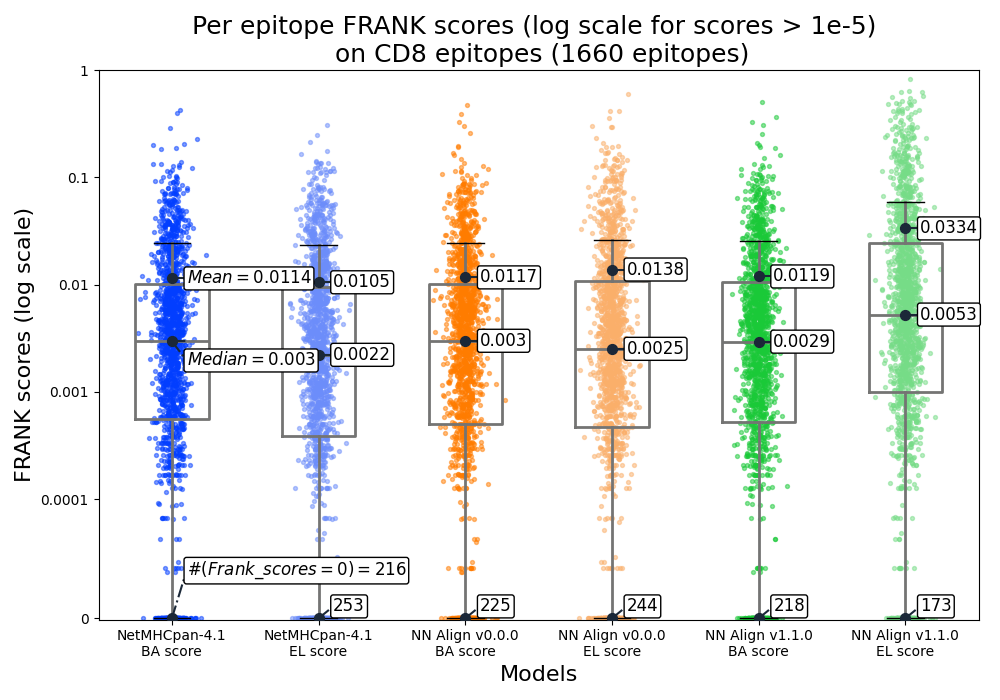

---
tags:
  - Denmark Technical University - DTU
  - MHC1
  - BA
  - SA
  - MA
---

# NetMHCpan-4.1 - v1.1.0

NetMHCpan-4.1[^1] is a **peptide-MHC1 presentation predictor** developed by the Denmark Technical
University (DTU).

It is based on multiple iterations of research, see the following "version history" (a more detailed
version of it is available in the [`Version history` tab of the official page of
NetMHCpan.4-1](https://services.healthtech.dtu.dk/services/NetMHCpan-4.1/)):

1. 1.0[^2] (2007): BA (binding affinity) data for HLA-A/B
1. 1.1 (2007): + predictions with 8-11mers
1. 2.0 (2008): + HLA-C/E/G and non-HLAs
1. 2.1 (2009): + percentile ranks for per-allele calibration
1. 2.2/2.3/2.4/2.8 (2009): new data only
1. 3.0[^3] (2016): + training on 8-13-length peptides thanks to a new alignment method with indels
   (NNAlign)
1. 4.0 (2017): + training on 14-length peptides  + EL SA (eluted ligand single-allelic) data with
   two outputs: likelihood of ligand presentation and binding affinity
1. 4.1[^6] (2019): + EL MA (eluted ligand multi-allelic) data thanks to NNAlign_MA (**this model**)
1. NetMHCpanExp-1.0[^7] (2022): + gene expression data

!!! info "Similarities and differences between original and reproduced NetMHCpan-4.1"

    The following table indicates whether technical details of the reproduced model are:

    - :green_circle: similar to the original model,

    - :yellow_circle: maybe different from the original model, as information was
      lacking in the published literature,

    - :red_circle: different from the original model by choice.

    | Technical details                                                      | Status          |
    |------------------------------------------------------------------------|-----------------|
    | [NNAlign technique](netmhcpan41_v_0_0_0.md#technical-nn-align)                               | :green_circle:  |
    | [Ensemble of 50 models](netmhcpan41_v_0_0_0.md#technical-ensemble)                           | :green_circle:  |
    | [Hidden size of the MLP](netmhcpan41_v_0_0_0.md#technical-hidden-size)                       | :yellow_circle: |
    | [MLP weight initialization](netmhcpan41_v_0_0_0.md#technical-mlp-initialization)             | :yellow_circle: |
    | [Input features](netmhcpan41_v_0_0_0.md#technical-features)                                  | :green_circle:  |
    | [BLOSUM62 amino acid encoding](netmhcpan41_v_0_0_0.md#technical-blosum62)                    | :yellow_circle: |
    | [Outputs](netmhcpan41_v_0_0_0.md#technical-outputs)                                          | :green_circle:  |
    | [Instance-based max pooling over 9mer cores](netmhcpan41_v_0_0_0.md#technical-instance-mil)  | :green_circle:  |
    | [9mer core selection for BA](netmhcpan41_v_0_0_0.md#technical-ba-score)                      | :yellow_circle: |
    | [Loss function](netmhcpan41_v_0_0_0.md#technical-loss)                                       | :yellow_circle: |
    | [Optimizer](netmhcpan41_v_0_0_0.md#technical-sgd)                                            | :green_circle:  |
    | [Number of epochs](netmhcpan41_v_0_0_0.md#technical-epochs)                                  | :green_circle:  |
    | [Early stopping](netmhcpan41_v_0_0_0.md#technical-early-stopping)                            | :yellow_circle: |
    | [Batch size](netmhcpan41_v_0_0_0.md#technical-batch-size)                                    | :yellow_circle: |
    | [Batch balancing](netmhcpan41_v_0_0_0.md#technical-batch-balancing)                          | :red_circle:    |
    | [Iterative annotation on MA data](netmhcpan41_v_0_0_0.md#technical-iterative-annotation)     | :green_circle:  |
    | [Prediction score rescaling](netmhcpan41_v_0_0_0.md#technical-prediction-score-rescaling)    | :green_circle:  |
    | [SA + MA validation data](netmhcpan41_v_0_0_0.md#technical-ma-validation-data)               | :red_circle:    |
    | [Training data](netmhcpan41_v_0_0_0.md#technical-training-data)                              | :red_circle:  |
    | [Evaluation data](netmhcpan41_v_0_0_0.md#technical-evaluation-data)                          | :red_circle:  |

---

All the listed sections are identical to the `v0.0.0` version. You can check the related documentation:

- [Architecture](netmhcpan41_v_0_0_0.md#architecture)
- [Training](netmhcpan41_v_0_0_0.md#training)
- [CD8 epitopes](netmhcpan41_v_0_0_0.md#cd8-epitopes)

The following sections differ from the `v0.0.0`.

## Training data

:red_circle: <a id="technical-training-data"></a> We used a regenerated version of the original data.
For detailed information about the training dataset, see the
[MS ligands v1.1.0 training data](../datasets/ms_ligands.md#training-v110) in the datasets
documentation.

---

## Evaluation data

:red_circle: <a id="technical-evaluation-data"></a> We use a regenerated version of the MS ligands
datasets. For detailed information about the evaluation dataset, see the
[MS ligands v2.0.0 evaluation data](../datasets/ms_ligands.md#evaluation-v200) in the datasets
documentation.

## Compute

The compute environment used is the following:

- custom-48-319488 (48 vCPUs, 312 GB Memory)
- 1 x NVIDIA T4
- Linux Debian 5.10.237-1 (2025-05-19) x86_64 GNU/Linux

8 trainings (up to 10) were launched in parallel with the native torch dataloader.
The following scripts were used to automate the launching of the trainings with tmux.

```bash
#!/bin/bash

# Script to launch 4 tmux sessions for training on different splits
# Each session will run train.sh with a different split number (0, 1, 2, 3)

# Colors for output
RED='\033[0;31m'
GREEN='\033[0;32m'
YELLOW='\033[1;33m'
NC='\033[0m' # No Color

# Function to create a tmux session for a specific split
create_tmux_session() {
    local split=$1
    local session_name="train_split_${split}"
    local num_submodel="00" # To increase


    echo -e "${YELLOW}Creating tmux session: ${session_name}${NC}"

    # Create new tmux session (detached)
    tmux new-session -d -s "$session_name"

    # Send commands to the tmux session
    tmux send-keys -t "$session_name" "cd /home/d-colombo/BenchMHC" Enter
    tmux send-keys -t "$session_name" "source .venv/bin/activate" Enter
    tmux send-keys -t "$session_name" "export SPLIT=\"${split}\"" Enter
    tmux send-keys -t "$session_name" "export NUM_SUBMODEL=\"${num_submodel}\"" Enter
    tmux send-keys -t "$session_name" "export RANDOM_SEED=\${SPLIT}\${NUM_SUBMODEL}" Enter
    tmux send-keys -t "$session_name" "echo \"Starting training for split ${split}...\"" Enter
    tmux send-keys -t "$session_name" "bash train.sh" Enter

    echo -e "${GREEN}Session ${session_name} created and training started${NC}"
}

# Check if tmux is installed
if ! command -v tmux &> /dev/null; then
    echo -e "${RED}Error: tmux is not installed. Please install tmux first.${NC}"
    exit 1
fi

# Check if we're in the correct directory
if [ ! -f "train.sh" ]; then
    echo -e "${RED}Error: train.sh not found. Please run this script from the BenchMHC directory.${NC}"
    exit 1
fi

# Check if virtual environment exists
if [ ! -d ".venv" ]; then
    echo -e "${RED}Error: .venv directory not found. Please ensure the virtual environment is set up.${NC}"
    exit 1
fi

echo -e "${YELLOW}Launching 5 tmux sessions for training on splits 0, 1, 2, 3, 4...${NC}"

# Create tmux sessions for splits 0, 1, 2, 3
for split in 0 1 2 3 4; do
    create_tmux_session "$split"
done
```

```bash
train \
-n nnalign_mhc1_ba_sa_ma_split_${SPLIT}_bs_1024_sgd_5en2_rs_${RANDOM_SEED} \
-c configuration/nnalign_ba_sa.yml \
-t "data/clean_data/training/ba_sa/split_${SPLIT}_train.csv" \
-v "data/clean_data/training/ba_sa/split_${SPLIT}_tune.csv" \
-rs ${RANDOM_SEED} \
-ma_t "data/clean_data/training/ma/split_${SPLIT}_train.csv" \
--use_prediction_score_rescaling \
--reference_path "data/reference/10k_9mers.csv" \
--sa_warmup_epochs 20 \
--deconvolution_identifier MA_bag_identifier
```

---

## Models

### SA + MA + BA

!!! info "Data paths"

    Here are the data paths:

    - BA + SA: `gs://bench-mhc/data/v1.1.0/training/ba_sa`
    - MA: `gs://bench-mhc/data/v1.1.0/training/ma/`

---

- Ensemble model:

```bash
gs://bench-mhc/models/nn_align_mhc1_ba_sa_ma_v_1_1_0_ensemble.txt
```

<!-- markdownlint-disable MD033 -->
<!-- markdownlint-disable MD013 -->

<div style="display: flex; flex-wrap: wrap; gap: 12px; justify-content: center;">

  <figure style="flex: 1 1 250px; min-width: 220px; max-width: 320px; margin: 0 10px 16px 0;">
    
    <figcaption style="text-align:center; font-size: 0.9em;">Training AP (average precision)</figcaption>
  </figure>

  <figure style="flex: 1 1 250px; min-width: 220px; max-width: 320px; margin: 0 10px 16px 0;">
    
    <figcaption style="text-align:center; font-size: 0.9em;">Training BA loss</figcaption>
  </figure>

  <figure style="flex: 1 1 250px; min-width: 220px; max-width: 320px; margin: 0 10px 16px 0;">
    
    <figcaption style="text-align:center; font-size: 0.9em;">Training loss</figcaption>
  </figure>

  <figure style="flex: 1 1 250px; min-width: 220px; max-width: 320px; margin: 0 10px 16px 0;">
    
    <figcaption style="text-align:center; font-size: 0.9em;">Validation AP (average precision)</figcaption>
  </figure>

  <figure style="flex: 1 1 250px; min-width: 220px; max-width: 320px; margin: 0 10px 16px 0;">
    
    <figcaption style="text-align:center; font-size: 0.9em;">Validation BA MSE</figcaption>
  </figure>

  <figure style="flex: 1 1 250px; min-width: 220px; max-width: 320px; margin: 0 10px 16px 0;">
    
    <figcaption style="text-align:center; font-size: 0.9em;">Validation loss</figcaption>
  </figure>
</div>

/// caption
Training and validation curves for BA + SA + MA model (NetMHCpan41 v1.1.0).
///

<div style="display: flex; justify-content: center;">
  <figure style="flex: 1 1 250px; min-width: 220px; max-width: 320px; margin: 0 10px 16px 0;">
    
    <figcaption style="text-align:center; font-size: 0.9em;">Epochs over relative time</figcaption>
  </figure>
</div>

<!-- markdownlint-enable MD033 -->
<!-- markdownlint-enable MD013 -->

- This model has been trained in the following issue:
  [#172](https://github.com/instadeepai/BenchMHC/issues/172).

## Performance

The performance of our models was evaluated using two benchmark datasets,
[CD8 epitopes](netmhcpan41_v_0_0_0.md#cd8-epitopes) and [MS ligands](netmhcpan41_v_0_0_0.md#ms-ligands).
These evaluation datasets can be found at:

```bash
gs://bench-mhc/data/v0.0.0/evaluation/raw_data/cd8_epitopes.csv
gs://bench-mhc/data/v2.0.0/evaluation/ms_ligands.csv
```

### Performance table

<!-- markdownlint-disable MD051 -->
<!-- to avoid issues with + in anchor links -->
| Model                             | Head              | Per-allele Mean Top-K on _MS ligands v2.0.0_ | Per-allele Global Top-K on _MS ligands v2.0.0_ | Per-allele Mean Top-K on _MS ligands v0.0.0_ | Per-allele Global Top-K on _MS ligands v0.0.0_ | Per-epitope Median FRANK Score on _CD8 epitopes_ | Per-epitope Mean FRANK Score on _CD8 epitopes_ |
| :-------------------------------- | :---------------- | :------------------------------------: | :--------------------------------------: | :------------------------------------: | :--------------------------------------: |  :------------------------------------: | :--------------------------------------: |
| **BA + SA + MA**      | Binding Affinity  | 0.692                                | 0.632                                   | **0.744** | 0.687 | **0.0029** | **0.0119** |
|                                  | Hit               | **0.755**                                | **0.741**                                   | 0.733 | **0.718**| 0.0053 | 0.0335 |
<!-- markdownlint-enable MD051 -->

### Performance plots MS ligands (v2.0.0)


/// caption
Per-allele PPV on MS ligands for each model. The box plots show the distribution of per-allele
PPVs across the 36 alleles in the evaluation set.
///

/// caption
Per-allele PPV on MS ligands for each model. The bar plots show the per-allele PPVs
for each of the 36 alleles in the evaluation set.
///

??? note "MS ligands plots reproduction"

    All metric files required to plot the MS ligands performance plots are available under :arrow_down:
    ```bash
    gs://bench-mhc/metrics/v2.0.0/nn_align_mhc1_v_0_0_0_ensemble__ms_ligands/
    gs://bench-mhc/metrics/v2.0.0/nn_align_mhc1_v_1_1_0_ensemble__ms_ligands/
    ```
    You can simply use the following configuration with the `generate-performance-plot` command line
    to regenerate the above plot.

    ```yaml
    "NN Align v0.0.0 - BA score":
      metrics_path: "metrics/v2.0.0/nn_align_mhc1_v_0_0_0_ensemble__ms_ligands/ms_ligands_nn_align_ba_sa_ma_ensemble_v000__binding_affinity_hit.csv"

    "NN Align v0.0.0 - EL score":
      metrics_path: "metrics/v2.0.0/nn_align_mhc1_v_0_0_0_ensemble__ms_ligands/ms_ligands_nn_align_ba_sa_ma_ensemble_v000__hit_hit.csv"
      bright_version_of: "NN Align v0.0.0 - BA score"

    "NN Align v1.1.0 - BA score":
      metrics_path: "metrics/v2.0.0/nn_align_mhc1_v_1_1_0_ensemble__ms_ligands/ms_ligands_nn_align_mhc1_ba_sa_ma_v_1_1_0_ensemble__binding_affinity_hit.csv"

    "NN Align v1.1.0 - EL score":
      metrics_path: "metrics/v2.0.0/nn_align_mhc1_v_1_1_0_ensemble__ms_ligands/ms_ligands_nn_align_mhc1_ba_sa_ma_v_1_1_0_ensemble__hit_hit.csv"
      bright_version_of: "NN Align v1.1.0 - BA score"
    ```

### Performance plots CD8 epitopes (v0.0.0)


/// caption
Per-epitope FRANK scores on CD8 epitopes for each model. The box plots show
the distribution of FRANK scores across the 1,660 epitopes in the evaluation set.
///

??? note "CD8 epitopes plot reproduction"

    All metric files required to plot the CD8 epitopes performance plot are available under :arrow_down:
    ```bash
    gs://bench-mhc/metrics/v0.0.0/nn_align_mhc1_v_0_0_0_ensemble__cd8
    gs://bench-mhc/metrics/v0.0.0/nn_align_mhc1_v_1_1_0_ensemble__cd8
    ```
    You can simply use the following configuration with the `generate-performance-plot` command line
    to regenerate the above plot.

    ```yaml
    "NetMHCpan-4.1 - BA score":
      metrics_path: "metrics/v0.0.0/nn_align_mhc1_v_0_0_0_ensemble__cd8/NetMHCpan_4_1___BA_score.csv"

    "NetMHCpan-4.1 - EL score":
      metrics_path: "metrics/v0.0.0/nn_align_mhc1_v_0_0_0_ensemble__cd8/NetMHCpan_4_1___EL_score.csv"
      bright_version_of: "NetMHCpan-4.1 - BA score"

    "NN Align v0.0.0 - BA score":
      metrics_path: "metrics/v0.0.0/nn_align_mhc1_v_0_0_0_ensemble__cd8/BA+SA+MA___BA_score.csv"

    "NN Align v0.0.0 - EL score":
      metrics_path: "metrics/v0.0.0/nn_align_mhc1_v_0_0_0_ensemble__cd8/BA+SA+MA___EL_score.csv"
      bright_version_of: "NN Align v0.0.0 - BA score"

    "NN Align v1.1.0 - BA score":
      metrics_path: "metrics/v0.0.0/nn_align_mhc1_v_1_1_0_ensemble__cd8/cd8_epitopes_exploded_w_epitope_column_nn_align_mhc1_ba_sa_ma_v_1_1_0_ensemble__binding_affinity_hit.csv"

    "NN Align v1.1.0 - EL score":
      metrics_path: "metrics/v0.0.0/nn_align_mhc1_v_1_1_0_ensemble__cd8/cd8_epitopes_exploded_w_epitope_column_nn_align_mhc1_ba_sa_ma_v_1_1_0_ensemble__hit_hit.csv"
      bright_version_of: "NN Align v1.1.0 - BA score"
    ```

## References

[^1]: [Official DTU page + webserver to make
    predictions](https://services.healthtech.dtu.dk/services/NetMHCpan-4.1/)
[^2]: [_NetMHCpan, a Method for Quantitative Predictions of Peptide Binding to Any HLA-A and -B
    Locus Protein of Known Sequence_, Nielsen et al.,
    2007](https://journals.plos.org/plosone/article?id=10.1371/journal.pone.0000796)
[^3]: [_NetMHCpan-3.0; improved prediction of binding to MHC class I molecules integrating
    information from multiple receptor and peptide length datasets_, Nielsen et al.,
    2016](https://pubmed.ncbi.nlm.nih.gov/27029192/)
[^6]: [_NetMHCpan-4.1 and NetMHCIIpan-4.0: improved predictions of MHC antigen presentation by
    concurrent motif deconvolution and integration of MS MHC eluted ligand data_, Reynisson et al.,
    2020](https://pubmed.ncbi.nlm.nih.gov/32406916/)
[^7]: [_The role of antigen expression in shaping the repertoire of HLA presented ligands_, Alvarez
    et al., 2022](https://pubmed.ncbi.nlm.nih.gov/36060059/)
